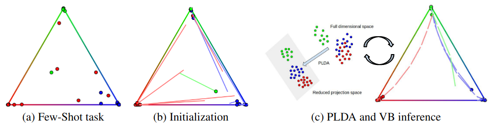

# Adaptive Dimension Reduction and Variational Inference for Transductive Few-Shot Classification

This repository is the official implementation of **[Adaptive Dimension Reduction and Variational Inference for Transductive Few-Shot Classification]**. 



## Requirements

To install requirements:

```setup
pip install -r requirements.txt
```

## Evaluation

To evaluate my model on CUB for the unbalanced setting, run:

```eval
python bavardage.py --shot 1/5 --T_km 10 --T_vb 4 --clp 5
```
For the balanced setting, run:

```eval
python bavardage.py --shot 1/5 --T_km 10 --T_vb 4 --clp 5 --balanced
```

## Pre-trained Models

We provide a WRN model pretrained on CUB in ./checkpoints

## Results

Our model achieves the following performance on :

### CUB 


| Model name         |     1 shot (unbalanced)      |     5 shot (unbalanced)    |     1 shot (balanced)      |     5 shot (balanced)    |
| ------------------ |----------------------------- | -------------------------- | -------------------------- | ------------------------ |
| BAVARDAGE          |      82.00%                  |      90.67%                |      85.64%                |      91.42%              |
